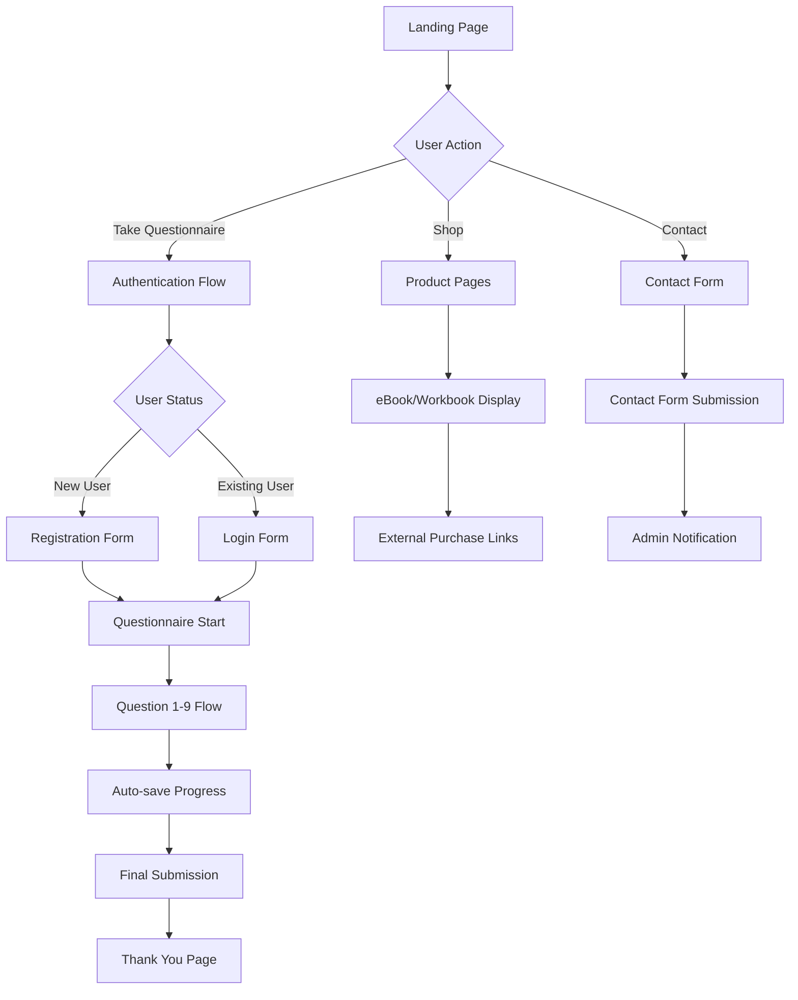

# Modern Matrimoney - Complete Architecture & Setup Guide

## Project Overview

Modern Matrimoney is a Next.js 14 application designed to help couples improve their financial communication and literacy. This comprehensive guide provides everything needed to replicate this architecture, including authentication flows, admin dashboards, and deployment strategies.

## Technology Stack & Architecture

### Frontend Stack
- **Next.js 14** - React framework with App Router
- **TypeScript** - Type safety and developer experience
- **Tailwind CSS** - Utility-first CSS framework with custom design system
- **Radix UI** - Accessible component primitives (shadcn/ui)
- **TanStack Query** - Server state management and caching
- **Lucide React** - Icon library
- **React Hook Form** - Form handling and validation

### Backend & Database
- **Supabase** - Backend-as-a-Service with PostgreSQL
- **Supabase Auth** - Authentication and user management
- **Supabase REST API** - Database operations
- **Zod** - Runtime schema validation
- **bcrypt/bcryptjs** - Password hashing

### Deployment & Infrastructure
- **Heroku** - Application hosting platform
- **Supabase Cloud** - Managed PostgreSQL database
- **Environment Variables** - Configuration management
- **Heroku Buildpacks** - Node.js deployment

## Complete Project Structure

```
modern-matrimoney/
├── app/                          # Next.js 14 App Router
│   ├── globals.css              # Global styles and design system
│   ├── layout.tsx               # Root layout with providers
│   ├── page.tsx                 # Landing page
│   ├── admin-dashboard/         # Admin dashboard interface
│   │   └── page.tsx
│   ├── admin/                   # Alternative admin view
│   │   └── page.tsx
│   ├── questionnaire/           # Questionnaire flow
│   │   └── page.tsx
│   ├── shop/                    # Product/shop page
│   │   └── page.tsx
│   ├── demo-selection/          # Demo selection page
│   │   └── page.tsx
│   ├── professional-signup/     # Professional signup page
│   │   └── page.tsx
│   └── api/                     # API routes
│       ├── auth/                # Authentication endpoints
│       │   ├── login/route.ts
│       │   ├── register/route.ts
│       │   └── validate/route.ts
│       ├── questionnaire/       # Questionnaire API
│       │   ├── submit/route.ts
│       │   ├── load/route.ts
│       │   └── responses/route.ts
│       ├── professionals/route.ts
│       ├── contact/route.ts
│       └── admin/               # Admin API endpoints
│           ├── questionnaire/route.ts
│           ├── professionals/route.ts
│           └── contact/route.ts
├── components/                   # React components
│   ├── ui/                      # shadcn/ui base components
│   │   ├── button.tsx
│   │   ├── input.tsx
│   │   ├── form.tsx
│   │   ├── textarea.tsx
│   │   ├── progress.tsx
│   │   ├── tabs.tsx
│   │   ├── card.tsx
│   │   ├── badge.tsx
│   │   ├── label.tsx
│   │   ├── toast.tsx
│   │   └── toaster.tsx
│   ├── landing/                 # Landing page components
│   │   ├── hero-section.tsx
│   │   ├── floating-menu.tsx
│   │   └── contact-form.tsx
│   ├── questionnaire.tsx        # Main questionnaire component
│   ├── landing.tsx              # Landing page container
│   └── demo-selection.tsx       # Demo selection interface
├── lib/                         # Utility libraries
│   ├── hooks/                   # Custom React hooks
│   │   └── use-toast.ts
│   ├── storage.ts               # Supabase integration layer
│   ├── query-provider.tsx       # TanStack Query setup
│   └── utils.ts                 # Utility functions
├── shared/                      # Shared schemas and types
│   └── schema.ts                # Drizzle schema and Zod validation
├── public/                      # Static assets
│   └── images/                  # Application images
├── .env                         # Environment variables (local)
├── .env.example                 # Environment template
├── .env.production              # Production environment template
├── .gitignore                   # Git ignore rules
├── next.config.js               # Next.js configuration
├── tailwind.config.js           # Tailwind CSS configuration
├── tsconfig.json                # TypeScript configuration
├── package.json                 # Dependencies and scripts
└── Procfile                     # Heroku deployment configuration
```

## Core Application Features

### 1. Authentication System
- **Implementation**: Custom auth with Supabase backend
- **Features**:
  - User registration with email/password
  - Secure login with bcrypt password hashing
  - Session management with localStorage/sessionStorage
  - User validation and session restoration
  - Password confirmation and validation
- **Files**:
  - `app/api/auth/register/route.ts` - User registration
  - `app/api/auth/login/route.ts` - User authentication
  - `app/api/auth/validate/route.ts` - Session validation
  - `lib/storage.ts` - Database operations
  - `shared/schema.ts` - User schema and validation

### 2. Multi-Step Questionnaire System
- **Implementation**: React state management with auto-save
- **Features**:
  - 9-question interactive assessment
  - Progress tracking and navigation
  - Multiple question types (radio, textarea)
  - Auto-save functionality
  - Session persistence
  - Responsive design with mobile optimization
- **Files**:
  - `components/questionnaire.tsx` - Main questionnaire component
  - `app/api/questionnaire/submit/route.ts` - Data submission
  - `app/api/questionnaire/load/route.ts` - Progress loading

### 3. Admin Dashboard System
- **Implementation**: Protected admin routes with API key authentication
- **Features**:
  - Real-time data visualization
  - Questionnaire response management
  - Professional signup tracking
  - Contact submission monitoring
  - Tabbed interface for data organization
  - Export capabilities
- **Files**:
  - `app/admin-dashboard/page.tsx` - Main admin interface
  - `app/admin/page.tsx` - Alternative admin view
  - `app/api/admin/*/route.ts` - Protected admin endpoints

### 4. Professional Signup & Contact System
- **Implementation**: Form handling with Supabase storage
- **Features**:
  - Professional pilot program registration
  - Contact form with relationship status tracking
  - Email validation and sanitization
  - Admin notification system
- **Files**:
  - `components/landing/contact-form.tsx` - Contact form component
  - `app/api/admin/professionals/route.ts` - Professional data
  - `app/api/admin/contact/route.ts` - Contact submissions

### 5. E-commerce Integration
- **Implementation**: Static product pages with external links
- **Features**:
  - Product showcase (eBook, workbook)
  - External purchase links
  - Coming soon functionality
  - Responsive product displays
- **Files**:
  - `app/shop/page.tsx` - Product catalog page

## Database Schema & Supabase Setup

### Required Supabase Tables

#### 1. users
```sql
CREATE TABLE users (
  id SERIAL PRIMARY KEY,
  email TEXT NOT NULL UNIQUE,
  password TEXT NOT NULL,
  first_name TEXT NOT NULL,
  last_name TEXT NOT NULL,
  phone TEXT NOT NULL,
  relationship_status TEXT,
  created_at TIMESTAMP DEFAULT NOW() NOT NULL
);

-- Add RLS policies
ALTER TABLE users ENABLE ROW LEVEL SECURITY;

-- Allow users to read their own data
CREATE POLICY "Users can read own data" ON users
  FOR SELECT USING (auth.uid()::text = id::text);

-- Allow service role to manage all users
CREATE POLICY "Service role can manage users" ON users
  FOR ALL USING (auth.role() = 'service_role');
```

#### 2. questionnaire_responses
```sql
CREATE TABLE questionnaire_responses (
  id SERIAL PRIMARY KEY,
  user_id INTEGER REFERENCES users(id) NOT NULL,
  answers JSONB NOT NULL,
  is_complete BOOLEAN DEFAULT FALSE NOT NULL,
  submitted_at TIMESTAMP DEFAULT NOW() NOT NULL,
  updated_at TIMESTAMP DEFAULT NOW() NOT NULL
);

-- Add RLS policies
ALTER TABLE questionnaire_responses ENABLE ROW LEVEL SECURITY;

-- Allow users to manage their own responses
CREATE POLICY "Users can manage own responses" ON questionnaire_responses
  FOR ALL USING (auth.uid()::text = user_id::text);

-- Allow service role to manage all responses
CREATE POLICY "Service role can manage responses" ON questionnaire_responses
  FOR ALL USING (auth.role() = 'service_role');

-- Add updated_at trigger
CREATE OR REPLACE FUNCTION update_updated_at_column()
RETURNS TRIGGER AS $$
BEGIN
    NEW.updated_at = NOW();
    RETURN NEW;
END;
$$ language 'plpgsql';

CREATE TRIGGER update_questionnaire_responses_updated_at 
  BEFORE UPDATE ON questionnaire_responses 
  FOR EACH ROW EXECUTE FUNCTION update_updated_at_column();
```

#### 3. professional_signups
```sql
CREATE TABLE professional_signups (
  id SERIAL PRIMARY KEY,
  name TEXT NOT NULL,
  firm TEXT NOT NULL,
  email TEXT NOT NULL,
  phone TEXT NOT NULL,
  specialty TEXT NOT NULL,
  submitted_at TIMESTAMP DEFAULT NOW() NOT NULL
);

-- Add RLS policies
ALTER TABLE professional_signups ENABLE ROW LEVEL SECURITY;

-- Allow service role to manage all signups
CREATE POLICY "Service role can manage signups" ON professional_signups
  FOR ALL USING (auth.role() = 'service_role');
```

#### 4. contact_submissions
```sql
CREATE TABLE contact_submissions (
  id SERIAL PRIMARY KEY,
  first_name TEXT NOT NULL,
  last_name TEXT NOT NULL,
  email TEXT NOT NULL,
  phone TEXT NOT NULL,
  relationship_status TEXT,
  message TEXT,
  submitted_at TIMESTAMP DEFAULT NOW() NOT NULL
);

-- Add RLS policies
ALTER TABLE contact_submissions ENABLE ROW LEVEL SECURITY;

-- Allow service role to manage all submissions
CREATE POLICY "Service role can manage submissions" ON contact_submissions
  FOR ALL USING (auth.role() = 'service_role');
```

### Supabase Configuration

#### Environment Variables Setup
```bash
# Supabase Project Settings
SUPABASE_URL=https://your-project.supabase.co
SUPABASE_ANON_KEY=your-anon-key
SUPABASE_SERVICE_ROLE_KEY=your-service-role-key

# Public (client-side)
NEXT_PUBLIC_SUPABASE_URL=https://your-project.supabase.co
NEXT_PUBLIC_SUPABASE_ANON_KEY=your-anon-key

# Admin protection
ADMIN_API_KEY=your-secure-admin-key
```

#### Row Level Security (RLS) Setup
- Enable RLS on all tables
- Create policies for user data access
- Use service role for admin operations
- Implement proper authentication checks

## API Architecture & Endpoints

### Authentication Endpoints
```typescript
// POST /api/auth/register
// Register new user with email/password
{
  email: string,
  password: string,
  firstName: string,
  lastName: string,
  phone: string,
  relationshipStatus?: string
}

// POST /api/auth/login
// Authenticate existing user
{
  email: string,
  password: string
}

// POST /api/auth/validate
// Validate existing session
{
  userId: number
}
```

### Questionnaire Endpoints
```typescript
// POST /api/questionnaire/submit
// Submit or update questionnaire responses
{
  userId: number,
  answers: Array<{questionId: string, question: string, answer: string}>,
  isComplete: boolean
}

// GET /api/questionnaire/load?userId=123
// Load existing questionnaire progress
// Returns: { exists: boolean, answers: any[], isComplete: boolean }
```

### Admin Endpoints (Protected with ADMIN_API_KEY)
```typescript
// GET /api/admin/questionnaire
// Retrieve all questionnaire responses with user data

// GET /api/admin/professionals  
// Retrieve all professional signups

// GET /api/admin/contact
// Retrieve all contact form submissions
```

### API Security Implementation
- **Authentication**: Custom JWT-like session management
- **Authorization**: Role-based access with admin API keys
- **Validation**: Zod schema validation on all inputs
- **Rate Limiting**: Implement with middleware (recommended)
- **CORS**: Configured for production domains

## Design System & UI Architecture

### Color System (CSS Variables)
```css
:root {
  /* Brand Colors */
  --brand-teal: #00A99D;
  --gold-light: #E6B800;
  --gold-dark: #CC9A00;
  --brand-coral: #FF6B6B;
  --earth-gray: #F2F2F2;
  --neutral-dark: #2E2E2E;
  
  /* Tailwind Integration */
  --background: 0 0% 100%;
  --foreground: 222.2 84% 4.9%;
  --primary: 221.2 83.2% 53.3%;
  /* ... additional Tailwind variables */
}
```

### Typography System
```css
/* Font Imports */
@import url('https://fonts.googleapis.com/css2?family=Playfair+Display:wght@400;700&family=Inter:wght@400;500;600&family=Roboto+Mono:wght@400;500&display=swap');

/* Typography Classes */
.font-heading { font-family: 'Playfair Display', serif; }
.font-body { font-family: 'Inter', sans-serif; }
.font-accent { font-family: 'Roboto Mono', monospace; }

.hero-title {
  font-family: 'Playfair Display', serif;
  font-weight: 700;
  font-size: clamp(3rem, 4vw, 5rem);
  line-height: 1.2;
  text-shadow: 0 6px 16px rgba(0, 0, 0, 0.2);
}

.section-title {
  font-family: 'Playfair Display', serif;
  font-weight: 700;
  font-size: clamp(2rem, 3vw, 3rem);
  background: linear-gradient(135deg, var(--neutral-dark) 0%, var(--brand-teal) 100%);
  -webkit-background-clip: text;
  -webkit-text-fill-color: transparent;
}
```

### Button System
```css
.btn-primary {
  background: linear-gradient(90deg, var(--gold-light), var(--gold-dark));
  color: white;
  border-radius: 8px;
  padding: 0.75rem 2rem;
  font-family: 'Roboto Mono', monospace;
  font-weight: 500;
  font-size: 0.875rem;
  text-transform: uppercase;
  letter-spacing: 0.05em;
  transition: transform 200ms ease-in-out, box-shadow 200ms;
}

.btn-secondary {
  border: 2px solid var(--brand-teal);
  color: var(--brand-teal);
  background: transparent;
  /* ... additional styles */
}

.btn-white {
  border: 2px solid white;
  color: white;
  background: rgba(255, 255, 255, 0.1);
  backdrop-filter: blur(8px);
  /* ... additional styles */
}
```

### Glassmorphic Design System
```css
.glassmorphic {
  backdrop-filter: blur(12px);
  background: rgba(255, 255, 255, 0.6);
  border: 1px solid rgba(255, 255, 255, 0.2);
}

/* Card Variations */
.bg-white/20 { background: rgba(255, 255, 255, 0.2); }
.bg-white/30 { background: rgba(255, 255, 255, 0.3); }
.bg-white/40 { background: rgba(255, 255, 255, 0.4); }

/* Backdrop Blur */
.backdrop-blur-sm { backdrop-filter: blur(4px); }
.backdrop-blur-md { backdrop-filter: blur(8px); }
.backdrop-blur-lg { backdrop-filter: blur(12px); }
```

### Responsive Design Patterns
```css
/* Mobile-First Breakpoints */
.xs\:text-sm { /* 475px+ */ }
.sm\:text-lg { /* 640px+ */ }
.md\:text-xl { /* 768px+ */ }
.lg\:text-2xl { /* 1024px+ */ }

/* Common Responsive Patterns */
.w-full.sm\:w-auto /* Full width mobile, auto desktop */
.px-1.xs\:px-2.sm\:px-8 /* Progressive padding */
.text-xs.xs\:text-sm.sm\:text-lg /* Progressive text sizing */
```

## State Management Architecture

### Client-Side State Management
```typescript
// TanStack Query Setup (lib/query-provider.tsx)
const queryClient = new QueryClient({
  defaultOptions: {
    queries: {
      retry: false,
      refetchOnWindowFocus: false,
      staleTime: 5 * 60 * 1000, // 5 minutes
    },
  },
})

// Usage in Components
const authMutation = useMutation({
  mutationFn: async (data) => {
    const response = await fetch('/api/auth/login', {
      method: 'POST',
      headers: { 'Content-Type': 'application/json' },
      body: JSON.stringify(data),
    });
    return response.json();
  },
  onSuccess: (userData) => {
    setUser(userData);
    sessionStorage.setItem('matrimoney_user', JSON.stringify({
      user: userData,
      timestamp: Date.now(),
      expiresIn: 24 * 60 * 60 * 1000 // 24 hours
    }));
  }
});
```

### Session Management
```typescript
// Session Storage Pattern
interface SessionData {
  user: User;
  timestamp: number;
  expiresIn: number;
}

// Session Validation
const validateSession = (sessionData: SessionData): boolean => {
  return Date.now() - sessionData.timestamp < sessionData.expiresIn;
};

// Auto-restore on page load
useEffect(() => {
  const storedUser = sessionStorage.getItem('matrimoney_user');
  if (storedUser) {
    const sessionData = JSON.parse(storedUser);
    if (validateSession(sessionData)) {
      validateStoredUser(sessionData.user);
    } else {
      sessionStorage.removeItem('matrimoney_user');
    }
  }
}, []);
```

### Form State Management
```typescript
// Questionnaire State Pattern
const [currentQuestion, setCurrentQuestion] = useState(0);
const [answers, setAnswers] = useState<Record<string, any>>({});
const [user, setUser] = useState<User | null>(null);

// Auto-save Implementation
useEffect(() => {
  if (user && Object.keys(answers).length > 0) {
    const autoSave = setTimeout(() => {
      saveProgress();
    }, 2000);
    return () => clearTimeout(autoSave);
  }
}, [answers, user]);

// Progress Persistence
const saveProgress = async () => {
  await fetch('/api/questionnaire/submit', {
    method: 'POST',
    headers: { 'Content-Type': 'application/json' },
    body: JSON.stringify({
      userId: user.id,
      answers,
      isComplete: false
    }),
  });
};
```

### Server-Side State (Supabase Integration)
```typescript
// Storage Layer Pattern (lib/storage.ts)
export interface IStorage {
  createUser(userData: InsertUser): Promise<User>;
  getUserByEmail(email: string): Promise<User | null>;
  validateUser(email: string, password: string): Promise<User | null>;
  createOrUpdateQuestionnaireResponse(userId: number, answers: any, isComplete?: boolean): Promise<QuestionnaireResponse>;
  // ... other methods
}

// Supabase Implementation
export class SupabaseStorage implements IStorage {
  async createUser(userData: InsertUser): Promise<User> {
    const hashedPassword = await bcrypt.hash(userData.password, 10);
    
    const { data, error } = await supabase
      .from('users')
      .insert({
        email: userData.email,
        password: hashedPassword,
        first_name: userData.firstName,
        last_name: userData.lastName,
        phone: userData.phone,
        relationship_status: userData.relationshipStatus,
      })
      .select()
      .single();

    if (error) throw new Error(`Supabase error: ${error.message}`);
    return mapSupabaseUser(data);
  }
}
```

## Complete User Experience Flows

### Primary User Journey


### Authentication Flow Details
```typescript
// Registration Flow
1. User fills registration form (email, password, name, phone, relationship status)
2. Frontend validates with Zod schema
3. API checks for existing user
4. Password hashed with bcrypt
5. User created in Supabase
6. Session established with 24-hour expiry
7. Redirect to questionnaire

// Login Flow  
1. User enters email/password
2. API validates credentials against hashed password
3. Session created and stored
4. Check for existing questionnaire progress
5. Redirect to appropriate page (questionnaire/completion)

// Session Management
1. Session stored in sessionStorage with timestamp
2. Auto-validation on page load
3. Expired sessions cleared automatically
4. Background session validation via API
```

### Admin Dashboard Flow
```typescript
// Admin Access Pattern
1. Admin navigates to /admin-dashboard
2. API key validation (ADMIN_API_KEY)
3. Data fetched from protected endpoints
4. Real-time statistics displayed
5. Tabbed interface for different data types

// Data Management
- Questionnaire responses with user details
- Professional signups with contact info
- Contact form submissions
- Export capabilities for data analysis
```

### Questionnaire Flow Details
```typescript
// Multi-step Form Pattern
const questions = [
  { id: 'relationship_status', type: 'radio', options: [...] },
  { id: 'time_together', type: 'radio', options: [...] },
  { id: 'reflective_story', type: 'textarea', optional: true },
  // ... 9 total questions
];

// Progress Management
- Progress bar shows completion percentage
- Navigation between questions with validation
- Auto-save every 2 seconds when answers change
- Session persistence across browser refreshes
- Final validation before submission
```

## Deployment & Production Setup

### Heroku Deployment Configuration

#### 1. Heroku Setup
```bash
# Install Heroku CLI
npm install -g heroku

# Login and create app
heroku login
heroku create your-app-name

# Set buildpack
heroku buildpacks:set heroku/nodejs

# Configure environment variables
heroku config:set NODE_ENV=production
heroku config:set SUPABASE_URL=your-supabase-url
heroku config:set SUPABASE_SERVICE_ROLE_KEY=your-service-key
heroku config:set ADMIN_API_KEY=your-admin-key
heroku config:set NEXT_PUBLIC_SUPABASE_URL=your-supabase-url
heroku config:set NEXT_PUBLIC_SUPABASE_ANON_KEY=your-anon-key
```

#### 2. Required Files
```javascript
// next.config.js
/** @type {import('next').NextConfig} */
const nextConfig = {
  reactStrictMode: true,
  eslint: {
    ignoreDuringBuilds: true,
  },
  serverExternalPackages: ['@supabase/supabase-js'],
  output: 'standalone'
}
module.exports = nextConfig

// Procfile
web: npm start

// package.json scripts
{
  "scripts": {
    "dev": "next dev",
    "build": "next build",
    "start": "next start",
    "lint": "next lint"
  }
}
```

#### 3. Environment Variables Structure
```bash
# .env.production (template - don't commit actual values)
DATABASE_URL=
SUPABASE_URL=
SUPABASE_ANON_KEY=
SUPABASE_SERVICE_ROLE_KEY=
ADMIN_API_KEY=
NEXT_PUBLIC_SUPABASE_URL=
NEXT_PUBLIC_SUPABASE_ANON_KEY=
PORT=
```

### Performance Optimization

#### Frontend Optimizations
```typescript
// Code Splitting with Dynamic Imports
const Questionnaire = dynamic(() => import('@/components/questionnaire'), {
  loading: () => <QuestionnaireLoading />,
  ssr: false
});

// Image Optimization
import Image from 'next/image'
<Image 
  src="/images/book-cover.jpg" 
  alt="Book Cover"
  width={300}
  height={400}
  priority={true}
  placeholder="blur"
/>

// TanStack Query Caching
const queryClient = new QueryClient({
  defaultOptions: {
    queries: {
      staleTime: 5 * 60 * 1000, // 5 minutes
      cacheTime: 10 * 60 * 1000, // 10 minutes
    },
  },
});
```

#### Backend Optimizations
```typescript
// Database Connection Pooling
const supabase = createClient(
  process.env.SUPABASE_URL,
  process.env.SUPABASE_SERVICE_ROLE_KEY,
  {
    db: {
      schema: 'public',
    },
    auth: {
      autoRefreshToken: false,
      persistSession: false
    }
  }
);

// API Response Caching
export async function GET(request: NextRequest) {
  const response = NextResponse.json(data);
  response.headers.set('Cache-Control', 'public, s-maxage=300, stale-while-revalidate=600');
  return response;
}
```

### Security Implementation

#### Authentication Security
```typescript
// Password Hashing
const hashedPassword = await bcrypt.hash(password, 10);

// Session Validation
const validateSession = async (userId: number) => {
  const user = await storage.getUserById(userId);
  return user ? user : null;
};

// API Route Protection
export async function GET(request: NextRequest) {
  const adminKey = request.headers.get('x-admin-key');
  if (adminKey !== process.env.ADMIN_API_KEY) {
    return NextResponse.json({ error: 'Unauthorized' }, { status: 401 });
  }
  // ... protected logic
}
```

#### Input Validation
```typescript
// Zod Schema Validation
export const insertUserSchema = createInsertSchema(users).omit({
  id: true,
  createdAt: true,
});

// API Validation
const validatedData = insertUserSchema.parse(body);
```

## Step-by-Step Setup Guide

### 1. Project Initialization
```bash
# Create Next.js project
npx create-next-app@latest modern-matrimoney --typescript --tailwind --eslint --app

# Install dependencies
npm install @supabase/supabase-js @tanstack/react-query
npm install @radix-ui/react-slot @radix-ui/react-toast
npm install class-variance-authority clsx tailwind-merge
npm install lucide-react zod drizzle-orm drizzle-zod
npm install bcrypt bcryptjs
npm install @types/bcrypt @types/bcryptjs

# Install shadcn/ui
npx shadcn-ui@latest init
npx shadcn-ui@latest add button input form textarea progress toast
```

### 2. Supabase Project Setup
```sql
-- 1. Create new Supabase project
-- 2. Run the SQL commands from the Database Schema section above
-- 3. Configure RLS policies
-- 4. Get your project URL and API keys
-- 5. Add to environment variables
```

### 3. Environment Configuration
```bash
# Create .env file
SUPABASE_URL=https://your-project.supabase.co
SUPABASE_ANON_KEY=your-anon-key
SUPABASE_SERVICE_ROLE_KEY=your-service-role-key
ADMIN_API_KEY=your-secure-admin-key
NEXT_PUBLIC_SUPABASE_URL=https://your-project.supabase.co
NEXT_PUBLIC_SUPABASE_ANON_KEY=your-anon-key
NODE_ENV=development
PORT=3000
```

### 4. Core File Structure Setup
```bash
# Create directory structure
mkdir -p app/api/auth/{login,register,validate}
mkdir -p app/api/questionnaire/{submit,load}
mkdir -p app/api/admin/{questionnaire,professionals,contact}
mkdir -p app/{admin-dashboard,questionnaire,shop}
mkdir -p components/{ui,landing}
mkdir -p lib/hooks
mkdir -p shared
mkdir -p public/images

# Copy the provided files into their respective locations
```

### 5. Tailwind Configuration
```javascript
// tailwind.config.js - Add custom colors and fonts
module.exports = {
  content: [
    './pages/**/*.{js,ts,jsx,tsx,mdx}',
    './components/**/*.{js,ts,jsx,tsx,mdx}',
    './app/**/*.{js,ts,jsx,tsx,mdx}',
  ],
  theme: {
    extend: {
      colors: {
        'brand-teal': '#00A99D',
        'gold-light': '#E6B800',
        'gold-dark': '#CC9A00',
        'brand-coral': '#FF6B6B',
        'earth-gray': '#F2F2F2',
        'neutral-dark': '#2E2E2E',
      },
      fontFamily: {
        heading: ['Playfair Display', 'serif'],
        body: ['Inter', 'sans-serif'],
        accent: ['Roboto Mono', 'monospace'],
      },
      screens: {
        'xs': '475px',
      },
    },
  },
  plugins: [],
}
```

### 6. TypeScript Configuration
```json
// tsconfig.json
{
  "compilerOptions": {
    "target": "ES2020",
    "lib": ["dom", "dom.iterable", "esnext"],
    "allowJs": true,
    "skipLibCheck": true,
    "strict": true,
    "noEmit": true,
    "esModuleInterop": true,
    "module": "esnext",
    "moduleResolution": "bundler",
    "resolveJsonModule": true,
    "isolatedModules": true,
    "jsx": "preserve",
    "incremental": true,
    "plugins": [{ "name": "next" }],
    "baseUrl": ".",
    "paths": {
      "@/*": ["./*"],
      "@/components/*": ["./components/*"],
      "@/lib/*": ["./lib/*"],
      "@/app/*": ["./app/*"],
      "@/shared/*": ["./shared/*"]
    }
  },
  "include": [
    "next-env.d.ts",
    "**/*.ts",
    "**/*.tsx",
    ".next/types/**/*.ts"
  ],
  "exclude": ["node_modules"]
}
```

### 7. Development Workflow
```bash
# Start development server
npm run dev

# Build for production
npm run build

# Start production server
npm start

# Deploy to Heroku
git add .
git commit -m "Initial deployment"
git push heroku main
```

### 8. Testing & Validation
```bash
# Test authentication flow
# 1. Register new user
# 2. Login with credentials
# 3. Complete questionnaire
# 4. Check admin dashboard

# Test admin functionality
# 1. Access /admin-dashboard with correct API key
# 2. View questionnaire responses
# 3. Check professional signups
# 4. Review contact submissions
```

## Comprehensive Testing Strategy

### Testing Framework Setup

#### Required Dependencies
```bash
# Core testing dependencies
npm install --save-dev jest @testing-library/react @testing-library/jest-dom
npm install --save-dev @testing-library/user-event jest-environment-jsdom
npm install --save-dev @types/jest ts-jest

# API testing
npm install --save-dev supertest @types/supertest
npm install --save-dev msw @mswjs/data

# E2E testing
npm install --save-dev @playwright/test
npm install --save-dev cypress @cypress/react

# Test utilities
npm install --save-dev test-data-bot faker
```

#### Jest Configuration
```javascript
// jest.config.js
const nextJest = require('next/jest')

const createJestConfig = nextJest({
  dir: './',
})

const customJestConfig = {
  setupFilesAfterEnv: ['<rootDir>/jest.setup.js'],
  testEnvironment: 'jest-environment-jsdom',
  testPathIgnorePatterns: ['<rootDir>/.next/', '<rootDir>/node_modules/'],
  moduleNameMapping: {
    '^@/(.*)$': '<rootDir>/$1',
  },
  collectCoverageFrom: [
    'components/**/*.{js,jsx,ts,tsx}',
    'app/**/*.{js,jsx,ts,tsx}',
    'lib/**/*.{js,jsx,ts,tsx}',
    '!**/*.d.ts',
    '!**/node_modules/**',
  ],
}

module.exports = createJestConfig(customJestConfig)

// jest.setup.js
import '@testing-library/jest-dom'
import { server } from './src/mocks/server'

beforeAll(() => server.listen())
afterEach(() => server.resetHandlers())
afterAll(() => server.close())
```

### Unit Testing Strategy

#### 1. Component Testing
```typescript
// __tests__/components/questionnaire.test.tsx
import { render, screen, fireEvent, waitFor } from '@testing-library/react'
import userEvent from '@testing-library/user-event'
import { QueryClient, QueryClientProvider } from '@tanstack/react-query'
import Questionnaire from '@/components/questionnaire'

const createTestQueryClient = () => new QueryClient({
  defaultOptions: {
    queries: { retry: false },
    mutations: { retry: false },
  },
})

const renderWithProviders = (component: React.ReactElement) => {
  const queryClient = createTestQueryClient()
  return render(
    <QueryClientProvider client={queryClient}>
      {component}
    </QueryClientProvider>
  )
}

describe('Questionnaire Component', () => {
  test('renders authentication form initially', () => {
    renderWithProviders(<Questionnaire />)
    
    expect(screen.getByText('Sign in or create an account')).toBeInTheDocument()
    expect(screen.getByRole('button', { name: /sign in/i })).toBeInTheDocument()
    expect(screen.getByRole('button', { name: /create account/i })).toBeInTheDocument()
  })

  test('switches between login and register modes', async () => {
    const user = userEvent.setup()
    renderWithProviders(<Questionnaire />)
    
    const registerButton = screen.getByRole('button', { name: /create account/i })
    await user.click(registerButton)
    
    expect(screen.getByLabelText(/first name/i)).toBeInTheDocument()
    expect(screen.getByLabelText(/last name/i)).toBeInTheDocument()
  })

  test('progresses through questionnaire after authentication', async () => {
    const user = userEvent.setup()
    renderWithProviders(<Questionnaire />)
    
    // Mock successful authentication
    // Fill in login form and submit
    await user.type(screen.getByLabelText(/email/i), 'test@example.com')
    await user.type(screen.getByLabelText(/password/i), 'password123')
    await user.click(screen.getByRole('button', { name: /sign in/i }))
    
    // Should show first question
    await waitFor(() => {
      expect(screen.getByText(/question 1 of 9/i)).toBeInTheDocument()
    })
  })

  test('saves progress automatically', async () => {
    const user = userEvent.setup()
    // Mock authenticated state
    renderWithProviders(<Questionnaire />)
    
    // Answer a question
    const radioOption = screen.getByLabelText(/solid, just looking to grow/i)
    await user.click(radioOption)
    
    // Verify auto-save is triggered (mock API call)
    await waitFor(() => {
      expect(mockSaveProgress).toHaveBeenCalledWith({
        userId: 1,
        answers: expect.objectContaining({
          relationship_status: 'Solid, just looking to grow'
        }),
        isComplete: false
      })
    }, { timeout: 3000 })
  })
})
```

#### 2. API Route Testing
```typescript
// __tests__/api/auth/register.test.ts
import { createMocks } from 'node-mocks-http'
import handler from '@/app/api/auth/register/route'
import * as storage from '@/lib/storage'

jest.mock('@/lib/storage')
const mockStorage = storage as jest.Mocked<typeof storage>

describe('/api/auth/register', () => {
  beforeEach(() => {
    jest.clearAllMocks()
  })

  test('creates new user successfully', async () => {
    const userData = {
      email: 'test@example.com',
      password: 'password123',
      firstName: 'John',
      lastName: 'Doe',
      phone: '555-0123',
      relationshipStatus: 'married'
    }

    mockStorage.getUserByEmail.mockResolvedValue(null)
    mockStorage.createUser.mockResolvedValue({
      id: 1,
      email: userData.email,
      firstName: userData.firstName,
      lastName: userData.lastName,
      phone: userData.phone,
      relationshipStatus: userData.relationshipStatus,
      createdAt: new Date()
    })

    const { req, res } = createMocks({
      method: 'POST',
      body: userData,
    })

    await handler(req, res)

    expect(res._getStatusCode()).toBe(201)
    expect(JSON.parse(res._getData())).toMatchObject({
      id: 1,
      email: userData.email,
      firstName: userData.firstName
    })
  })

  test('returns error for existing user', async () => {
    const userData = {
      email: 'existing@example.com',
      password: 'password123',
      firstName: 'Jane',
      lastName: 'Doe',
      phone: '555-0124'
    }

    mockStorage.getUserByEmail.mockResolvedValue({
      id: 1,
      email: userData.email,
      firstName: userData.firstName,
      lastName: userData.lastName,
      phone: userData.phone,
      createdAt: new Date()
    })

    const { req, res } = createMocks({
      method: 'POST',
      body: userData,
    })

    await handler(req, res)

    expect(res._getStatusCode()).toBe(400)
    expect(JSON.parse(res._getData())).toEqual({
      error: 'User already exists with this email'
    })
  })
})
```

### Integration Testing

#### 1. Admin Dashboard Testing
```typescript
// __tests__/integration/admin-dashboard.test.tsx
import { render, screen, waitFor } from '@testing-library/react'
import userEvent from '@testing-library/user-event'
import AdminDashboard from '@/app/admin-dashboard/page'
import { server } from '@/mocks/server'
import { rest } from 'msw'

describe('Admin Dashboard Integration', () => {
  test('loads and displays questionnaire responses', async () => {
    // Mock API responses
    server.use(
      rest.get('/api/admin/questionnaire', (req, res, ctx) => {
        return res(ctx.json([
          {
            id: 1,
            userId: 1,
            user: { firstName: 'John', lastName: 'Doe', email: 'john@example.com' },
            answers: [
              { questionId: 'q1', question: 'Test Question', answer: 'Test Answer' }
            ],
            submittedAt: '2025-01-01T00:00:00Z',
            isComplete: true
          }
        ]))
      })
    )

    render(<AdminDashboard />)

    // Wait for data to load
    await waitFor(() => {
      expect(screen.getByText('John Doe')).toBeInTheDocument()
      expect(screen.getByText('john@example.com')).toBeInTheDocument()
      expect(screen.getByText('Test Answer')).toBeInTheDocument()
    })
  })

  test('switches between different data tabs', async () => {
    const user = userEvent.setup()
    render(<AdminDashboard />)

    // Click on Professional Signups tab
    const professionalsTab = screen.getByRole('tab', { name: /professional signups/i })
    await user.click(professionalsTab)

    await waitFor(() => {
      expect(screen.getByText(/professional signups/i)).toBeInTheDocument()
    })

    // Click on Contact Messages tab
    const contactTab = screen.getByRole('tab', { name: /contact messages/i })
    await user.click(contactTab)

    await waitFor(() => {
      expect(screen.getByText(/contact messages/i)).toBeInTheDocument()
    })
  })
})
```

### End-to-End Testing

#### 1. Playwright E2E Tests
```typescript
// e2e/questionnaire-flow.spec.ts
import { test, expect } from '@playwright/test'

test.describe('Complete Questionnaire Flow', () => {
  test('user can complete entire questionnaire journey', async ({ page }) => {
    await page.goto('/')

    // Navigate to questionnaire
    await page.click('text=Take the Free Questionnaire')
    
    // Register new user
    await page.click('text=Create Account')
    await page.fill('[name="firstName"]', 'John')
    await page.fill('[name="lastName"]', 'Doe')
    await page.fill('[name="email"]', 'john.doe@example.com')
    await page.fill('[name="phone"]', '555-0123')
    await page.fill('[name="password"]', 'password123')
    await page.fill('[name="confirmPassword"]', 'password123')
    await page.selectOption('[name="relationshipStatus"]', 'married')
    
    await page.click('text=Create Account')
    
    // Should start questionnaire
    await expect(page.locator('text=Question 1 of 9')).toBeVisible()
    
    // Answer all questions
    for (let i = 1; i <= 9; i++) {
      await expect(page.locator(`text=Question ${i} of 9`)).toBeVisible()
      
      // Answer based on question type
      const radioOption = page.locator('input[type="radio"]').first()
      if (await radioOption.isVisible()) {
        await radioOption.click()
      } else {
        // Handle textarea questions
        const textarea = page.locator('textarea')
        if (await textarea.isVisible()) {
          await textarea.fill('This is my test answer for the question.')
        }
      }
      
      // Go to next question (except last)
      if (i < 9) {
        await page.click('text=Next')
      }
    }
    
    // Submit final questionnaire
    await page.click('text=Submit Responses')
    
    // Should show completion message
    await expect(page.locator('text=Thank You!')).toBeVisible()
  })

  test('user can save and resume progress', async ({ page }) => {
    await page.goto('/questionnaire')
    
    // Login as existing user
    await page.fill('[name="email"]', 'existing@example.com')
    await page.fill('[name="password"]', 'password123')
    await page.click('text=Sign In')
    
    // Answer first few questions
    await page.click('input[value="Solid, just looking to grow"]')
    await page.click('text=Next')
    
    await page.click('input[value="1 to 3 years"]')
    await page.click('text=Next')
    
    // Refresh page to simulate session restoration
    await page.reload()
    
    // Should resume from where left off
    await expect(page.locator('text=Question 3 of 9')).toBeVisible()
    
    // Previous answers should be preserved
    await page.click('text=Previous')
    await expect(page.locator('input[value="1 to 3 years"]:checked')).toBeVisible()
  })
})
```

### Performance Testing

#### 1. Load Testing
```typescript
// __tests__/performance/load.test.ts
import { performance } from 'perf_hooks'

describe('Performance Tests', () => {
  test('questionnaire submission completes within acceptable time', async () => {
    const startTime = performance.now()
    
    const response = await fetch('/api/questionnaire/submit', {
      method: 'POST',
      headers: { 'Content-Type': 'application/json' },
      body: JSON.stringify({
        userId: 1,
        answers: Array.from({ length: 9 }, (_, i) => ({
          questionId: `q${i + 1}`,
          question: `Question ${i + 1}`,
          answer: `Answer ${i + 1}`
        })),
        isComplete: true
      })
    })
    
    const endTime = performance.now()
    const duration = endTime - startTime
    
    expect(response.ok).toBe(true)
    expect(duration).toBeLessThan(2000) // Should complete within 2 seconds
  })

  test('admin dashboard loads data within acceptable time', async () => {
    const startTime = performance.now()
    
    const response = await fetch('/api/admin/questionnaire')
    const data = await response.json()
    
    const endTime = performance.now()
    const duration = endTime - startTime
    
    expect(response.ok).toBe(true)
    expect(Array.isArray(data)).toBe(true)
    expect(duration).toBeLessThan(1000) // Should load within 1 second
  })
})
```

### Running Tests

#### Test Scripts (package.json)
```json
{
  "scripts": {
    "test": "jest",
    "test:watch": "jest --watch",
    "test:coverage": "jest --coverage",
    "test:e2e": "playwright test",
    "test:e2e:ui": "playwright test --ui",
    "test:integration": "jest --testPathPattern=integration",
    "test:unit": "jest --testPathPattern=__tests__ --testPathIgnorePatterns=integration",
    "test:performance": "jest --testPathPattern=performance"
  }
}
```

#### Running Different Test Types
```bash
# Run all tests
npm test

# Run tests in watch mode during development
npm run test:watch

# Run tests with coverage report
npm run test:coverage

# Run only unit tests
npm run test:unit

# Run integration tests
npm run test:integration

# Run E2E tests
npm run test:e2e

# Run E2E tests with UI
npm run test:e2e:ui

# Run performance tests
npm run test:performance
```

## Advanced Features & Customization

### Custom Authentication System
```typescript
// Extend the authentication system
interface ExtendedUser extends User {
  role: 'user' | 'admin' | 'professional';
  preferences: UserPreferences;
  subscription: SubscriptionStatus;
}

// Role-based access control
const useAuth = () => {
  const [user, setUser] = useState<ExtendedUser | null>(null);
  
  const hasRole = (role: string) => user?.role === role;
  const hasPermission = (permission: string) => {
    // Implement permission logic
  };
  
  return { user, hasRole, hasPermission };
};
```

### Advanced Questionnaire Features
```typescript
// Conditional question logic
const getNextQuestion = (currentIndex: number, answers: Answers) => {
  const current = questions[currentIndex];
  
  // Skip questions based on previous answers
  if (current.condition && !current.condition(answers)) {
    return getNextQuestion(currentIndex + 1, answers);
  }
  
  return currentIndex;
};

// Question branching
const questions = [
  {
    id: 'relationship_status',
    type: 'radio',
    options: ['married', 'engaged', 'dating'],
    next: (answer) => answer === 'married' ? 'married_questions' : 'general_questions'
  }
];
```

### Enhanced Admin Dashboard
```typescript
// Real-time updates with Supabase subscriptions
const useRealtimeData = (table: string) => {
  const [data, setData] = useState([]);
  
  useEffect(() => {
    const subscription = supabase
      .channel(`public:${table}`)
      .on('postgres_changes', 
        { event: '*', schema: 'public', table },
        (payload) => {
          // Update data in real-time
          setData(current => [...current, payload.new]);
        }
      )
      .subscribe();
      
    return () => subscription.unsubscribe();
  }, [table]);
  
  return data;
};

// Advanced analytics
const AdminAnalytics = () => {
  const responses = useRealtimeData('questionnaire_responses');
  
  const analytics = useMemo(() => ({
    completionRate: calculateCompletionRate(responses),
    averageTime: calculateAverageTime(responses),
    dropoffPoints: findDropoffPoints(responses),
    demographics: analyzeDemographics(responses)
  }), [responses]);
  
  return <AnalyticsDashboard data={analytics} />;
};
```

## Troubleshooting & Common Issues

### Authentication Issues
```typescript
// Common authentication problems and solutions

// 1. Session not persisting
// Solution: Check sessionStorage implementation
const sessionData = {
  user: userData,
  timestamp: Date.now(),
  expiresIn: 24 * 60 * 60 * 1000 // 24 hours
};
sessionStorage.setItem('matrimoney_user', JSON.stringify(sessionData));

// 2. Password hashing inconsistency
// Solution: Ensure consistent bcrypt usage
let bcrypt;
try {
  bcrypt = require('bcrypt');
} catch (err) {
  bcrypt = require('bcryptjs'); // Fallback
}

// 3. Supabase RLS blocking requests
// Solution: Check RLS policies and service role usage
const { data, error } = await supabase
  .from('users')
  .select('*')
  .eq('id', userId);
```

### Database Connection Issues
```typescript
// Supabase connection troubleshooting

// 1. Environment variables not loading
if (!process.env.SUPABASE_URL || !process.env.SUPABASE_SERVICE_ROLE_KEY) {
  throw new Error('Missing required Supabase environment variables');
}

// 2. RLS policy conflicts
// Check that service role has proper access:
CREATE POLICY "Service role can manage users" ON users
  FOR ALL USING (auth.role() = 'service_role');

// 3. Connection pooling issues
const supabase = createClient(
  process.env.SUPABASE_URL,
  process.env.SUPABASE_SERVICE_ROLE_KEY,
  {
    auth: {
      autoRefreshToken: false,
      persistSession: false
    }
  }
);
```

### Deployment Issues
```bash
# Heroku deployment troubleshooting

# 1. Build failures
heroku logs --tail
# Check for missing dependencies or environment variables

# 2. Environment variable issues
heroku config
# Verify all required variables are set

# 3. Database connection issues
heroku config:set DATABASE_URL=your-supabase-connection-string

# 4. Port binding issues
# Ensure Procfile is correct:
web: npm start
```

### Performance Issues
```typescript
// Performance optimization troubleshooting

// 1. Slow API responses
// Add request timing
console.time('api-request');
const response = await fetch('/api/endpoint');
console.timeEnd('api-request');

// 2. Large bundle sizes
// Analyze bundle
npm run build
# Check .next/static/chunks/ for large files

// 3. Memory leaks
// Check for unsubscribed event listeners
useEffect(() => {
  const subscription = supabase.channel('changes').subscribe();
  return () => subscription.unsubscribe(); // Important!
}, []);
```

## Production Checklist

### Pre-Deployment
- [ ] Environment variables configured
- [ ] Database schema deployed
- [ ] RLS policies configured
- [ ] API endpoints tested
- [ ] Authentication flow verified
- [ ] Admin dashboard accessible
- [ ] Error handling implemented
- [ ] Security headers configured
- [ ] CORS policies set
- [ ] Rate limiting implemented (optional)

### Post-Deployment
- [ ] SSL certificate active
- [ ] Domain configured
- [ ] Database backups enabled
- [ ] Monitoring setup
- [ ] Error tracking configured
- [ ] Performance monitoring active
- [ ] User registration tested
- [ ] Questionnaire flow verified
- [ ] Admin access confirmed
- [ ] Email notifications working (if implemented)

### Monitoring & Maintenance
- [ ] Regular database backups
- [ ] Security updates applied
- [ ] Performance metrics reviewed
- [ ] User feedback collected
- [ ] Error logs monitored
- [ ] Capacity planning reviewed
- [ ] Feature usage analyzed
- [ ] A/B testing implemented (optional)

## Additional Resources & References

### Documentation Links
- [Next.js 14 Documentation](https://nextjs.org/docs)
- [Supabase Documentation](https://supabase.com/docs)
- [TanStack Query Documentation](https://tanstack.com/query/latest)
- [Tailwind CSS Documentation](https://tailwindcss.com/docs)
- [shadcn/ui Components](https://ui.shadcn.com/)
- [Heroku Node.js Deployment](https://devcenter.heroku.com/articles/deploying-nodejs)
- [Jest Testing Framework](https://jestjs.io/docs/getting-started)
- [React Testing Library](https://testing-library.com/docs/react-testing-library/intro/)
- [Playwright E2E Testing](https://playwright.dev/docs/intro)

### Code Examples Repository
```bash
# Clone the reference implementation
git clone https://github.com/your-org/modern-matrimoney-reference
cd modern-matrimoney-reference

# Install dependencies
npm install

# Set up environment
cp .env.example .env
# Fill in your Supabase credentials

# Run development server
npm run dev

# Run test suite
npm test
```

### Community & Support
- **GitHub Issues**: Report bugs and request features
- **Discord Community**: Real-time help and discussions
- **Documentation Wiki**: Extended guides and tutorials
- **Video Tutorials**: Step-by-step implementation guides

### License & Usage
This architecture guide is provided under MIT License. Feel free to use, modify, and distribute for your projects. Attribution appreciated but not required.

---

**Last Updated**: January 2025
**Version**: 1.0.0
**Compatibility**: Next.js 14+, Supabase, Heroku

This architecture provides a complete foundation for building a modern, scalable Next.js application with authentication, data management, and admin capabilities. The modular design allows for easy customization and extension based on specific requirements.
